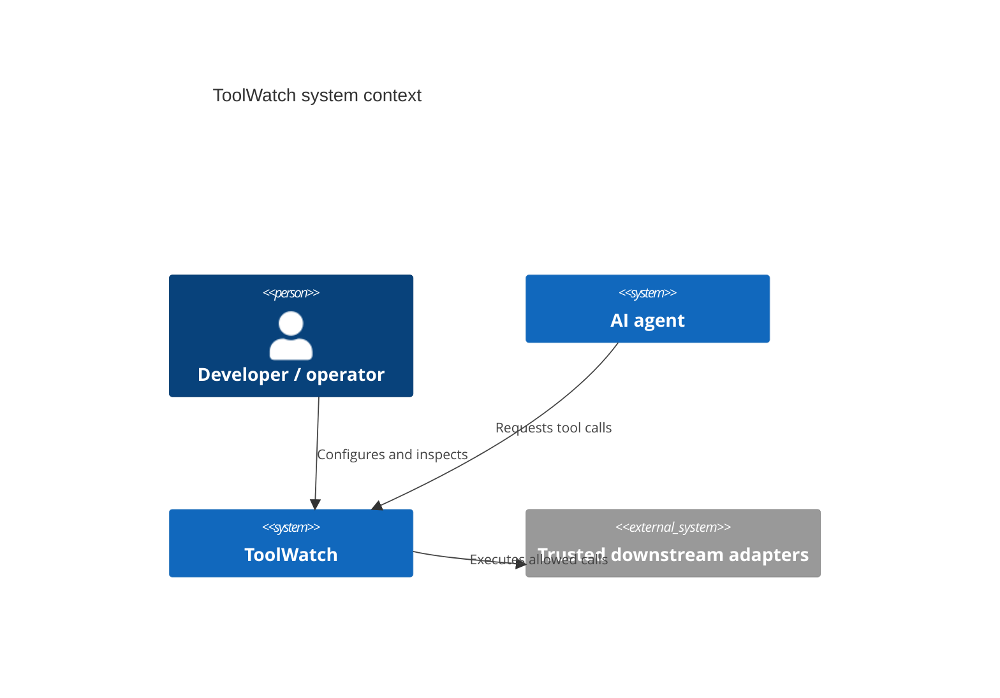
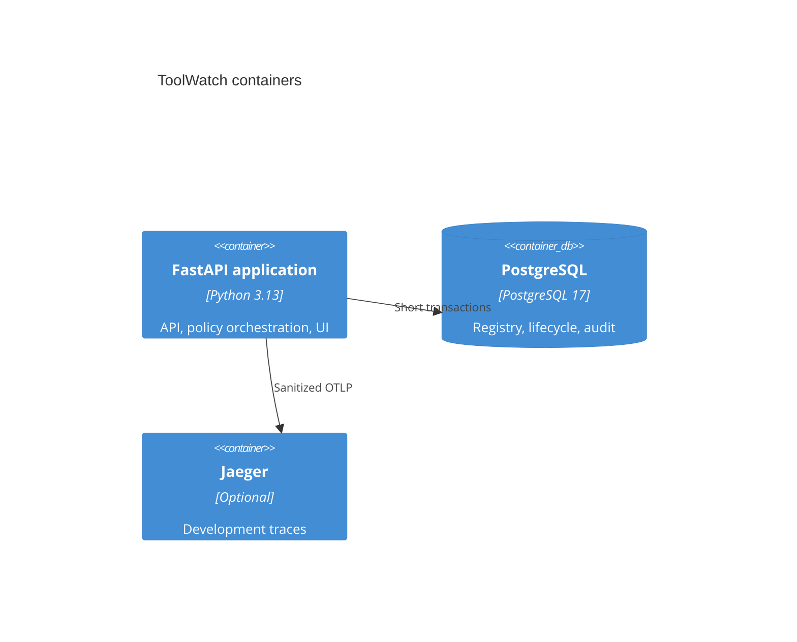
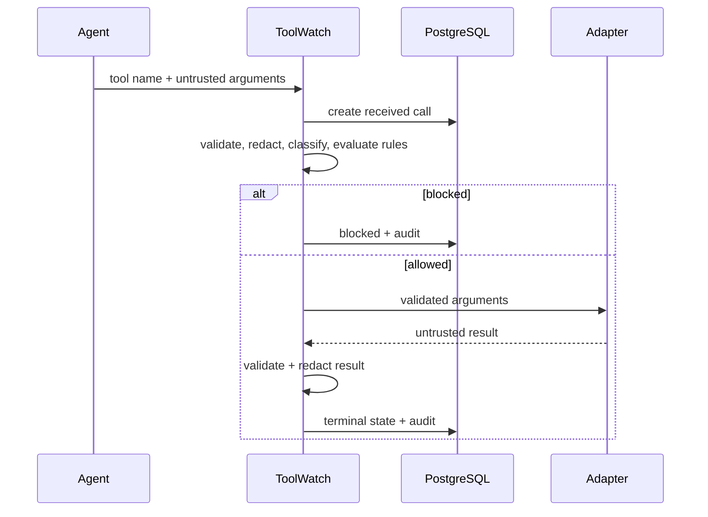
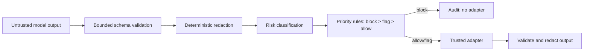
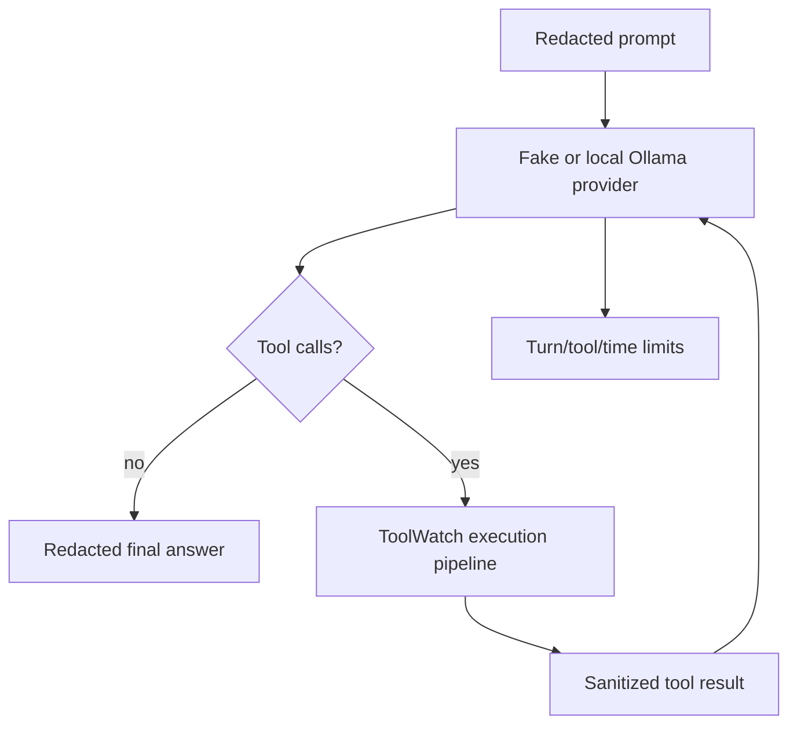

# ToolWatch portfolio evidence

## Business problem

AI agents can turn untrusted model output into real side effects. ToolWatch inserts a
deterministic, auditable execution boundary between an agent and its tools.

## Architectural decisions

The modular monolith keeps security-sensitive ordering reviewable. Domain types have no
framework imports. PostgreSQL constraints backstop uniqueness and lifecycle consistency.
Adapters come from an immutable allowlist; database values are never import paths.

## Threat model and controls

Controls include bounded payloads, deterministic rule evaluation, sanitized persistence,
safe public errors, strict telemetry allowlists, CSP-protected escaped UI rendering, and
durable idempotency.

## Concurrency, crash recovery, and shutdown

Session locks allocate ordered call sequences. Unique idempotency keys prevent concurrent
duplicate side effects. Adapter I/O runs without a database transaction. Recovery locks
stale rows with `FOR UPDATE SKIP LOCKED`, marks unknown execution failed, emits audit and
metrics, and never retries. Shutdown rejects new requests, waits for in-flight work for a
bounded period, cancels the remainder, closes HTTP/database resources, and flushes
telemetry.

## Agent loop

## Testing and performance

Unit tests are network-free. Integration tests use PostgreSQL Testcontainers. Security
properties include secret-absence checks across storage and observability surfaces.
Local LLM checks assert semantic safety outcomes rather than exact text. The reproducible
load harness reports throughput, p50/p95/p99, and error rate; query plans are captured by
`scripts/query_plans.py`.

Release measurements must be recorded in `docs/performance.md` after running on the
target workstation; the targets are engineering guidance, not production SLAs.

## Trade-offs and interview discussion

- A modular monolith favors reviewability over independent scaling.
- There is no distributed transaction with external effects; recovery is conservative.
- Synchronous agent runs are simpler but occupy a request worker.
- Heuristic prompt-injection detection is a signal, not a proof.
- The most important design choice is that no LLM participates in security decisions.
